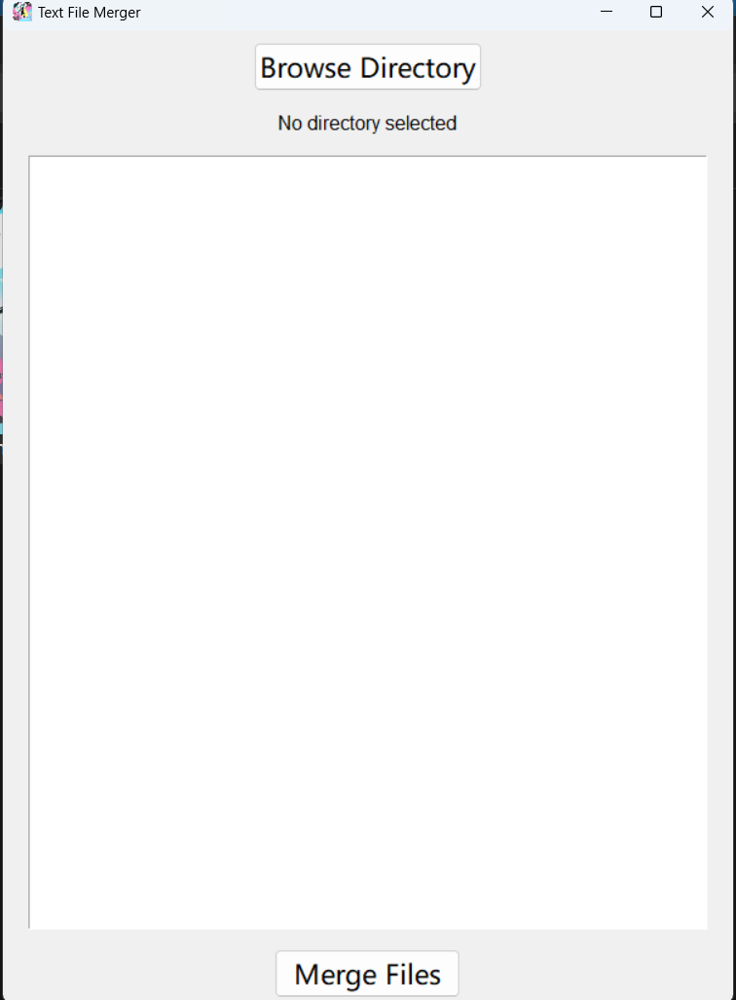

TXT文档合并工具。

Rust编译环境崩了，懒得重装，用python写一个吧，反正也就是自用。

纯GUI模式。

使用很简单，选择文件夹，会自动读取所有txt文档，如果顺序不对就用鼠标拖拽排序，然后选择合并就行。

默认用文件名当标题，然后在前面添加【第x章】的字样，如果不喜欢，可以自行修改代码。

另外不想装python的话，我打包了个EXE，就这么点功能，10.7M……

😫顿时想起来当初为啥要用Rust了
