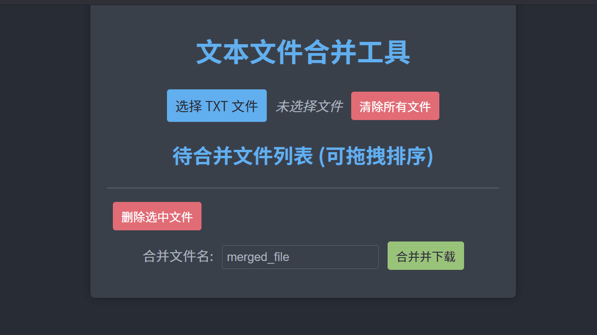

# 文本文件合并工具 (Web 版)

这是一个使用 HTML, CSS, 和 JavaScript 实现的文本文件合并工具，完全在浏览器中运行，无需服务器端处理。

## 功能

*   选择多个 TXT 文件进行合并。
*   通过拖拽调整文件合并的顺序。
*   为每个文件添加章节标题（基于文件名）。
*   将合并后的内容下载为单个 TXT 文件。
*   支持删除单个文件或批量删除选中的文件。
*   提供清除所有已选文件的功能。
*   护眼暗色主题界面。

## 如何使用

1.  在浏览器中打开 `index.html` 文件。
2.  点击“选择 TXT 文件”按钮，选择您想要合并的 TXT 文件（可以一次选择多个）。
3.  文件列表将显示在页面上。如果顺序不正确，可以通过拖拽列表项来调整文件的合并顺序。
4.  （可选）您可以勾选文件旁边的复选框，然后点击“删除选中文件”按钮来移除不需要的文件，或者点击每个文件旁边的“删除”按钮单独删除。
5.  （可选）点击“清除所有文件”按钮可以移除列表中的所有文件。
6.  在“合并文件名”输入框中输入您希望合并后文件的名称（默认为 `merged_file`）。
7.  点击“合并并下载”按钮。浏览器将生成合并后的文件并触发下载。

## 项目结构

*   `index.html`: 工具的主页面。
*   `assets/`: 存放项目资源的文件夹。
    *   `css/`: 存放样式文件。
        *   `style.css`: 页面的样式表。
    *   `js/`: 存放 JavaScript 文件。
        *   `script.js`: 工具的核心逻辑。
    *   `images/`: 存放图片资源。

这个工具完全基于浏览器端技术实现，因此非常轻便且易于使用。
